ShopEase - Online Shopping Web Application

ShopEase is a full-stack e-commerce web application developed using
Python Flask, MySQL, HTML, CSS, and JavaScript. The application provides
a modern online shopping experience inspired by popular e-commerce
platforms.

Features
---

# 📸 Project Screenshots

## 🏠 Home Page

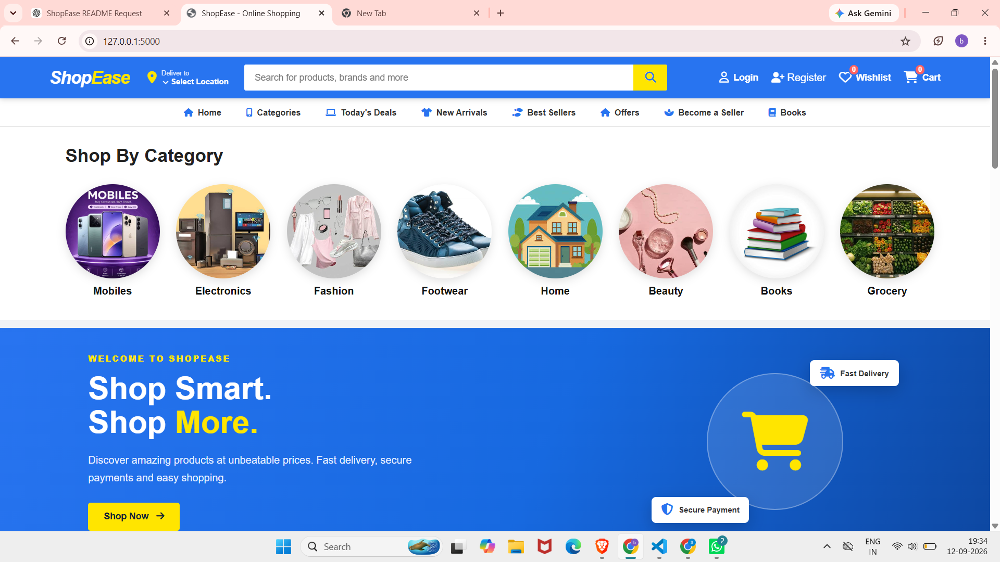

---

## 🔐 Login Page

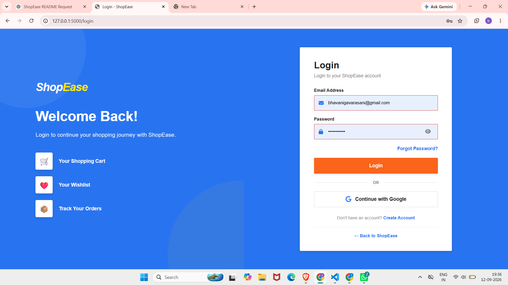

---

## 📝 Register Page

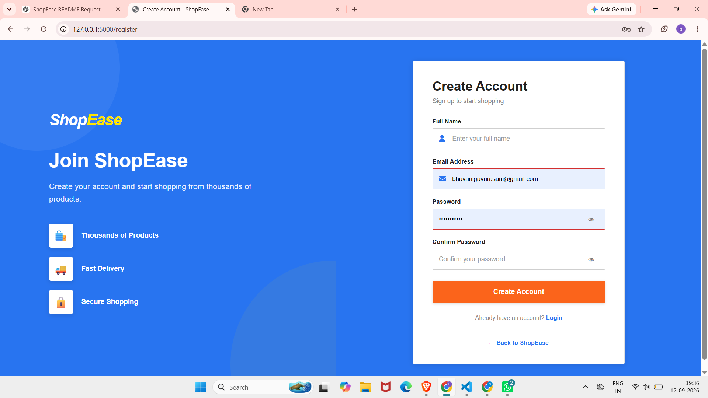

## 📝 forgot password

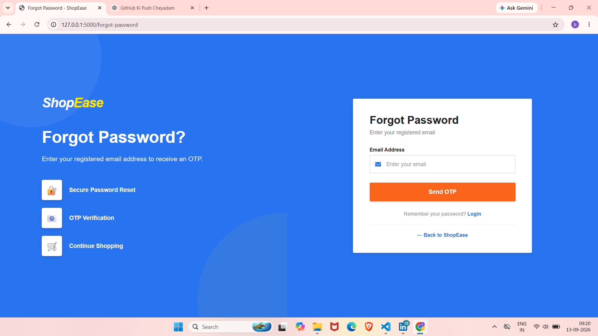

## 📝 verify otp

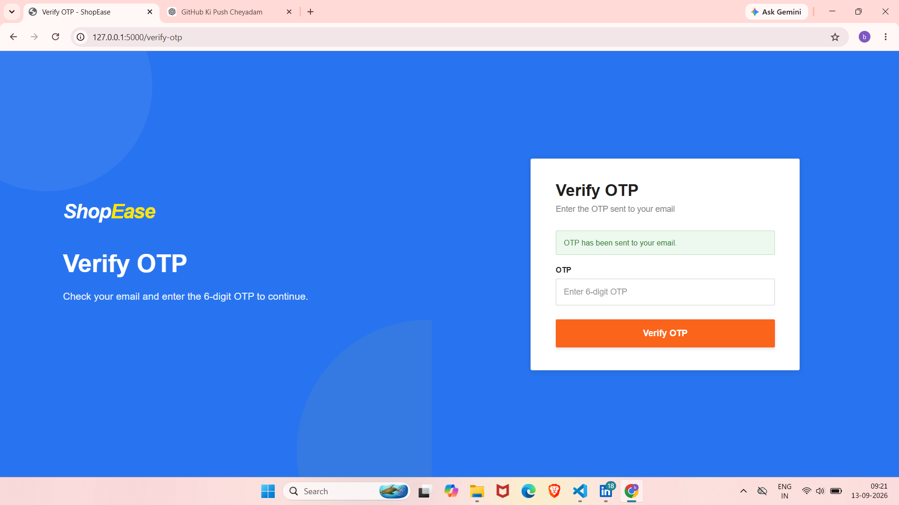

## 📝 reset password

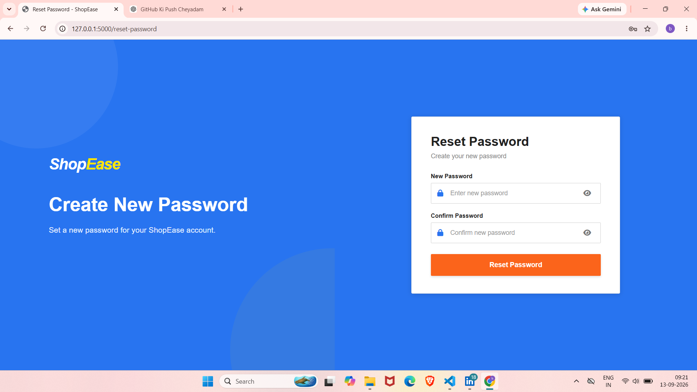

---

## 🛍️ Products Page

.png)

---

## 📦 Product Details

.png)

## 📦 Product Details

.png)

## 📦 Product Details

---

## ❤️ Wishlist

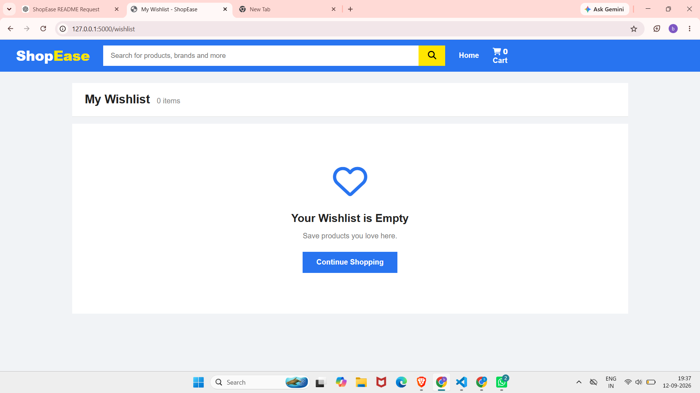

---

## 🛒 Shopping Cart

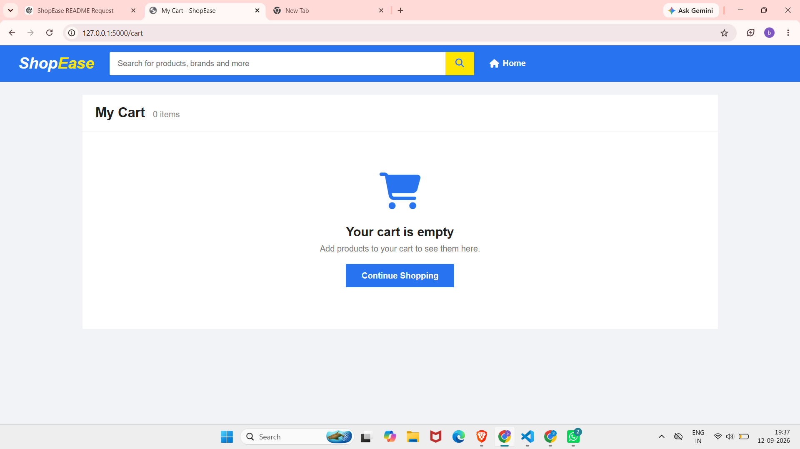

---

## 📍 Manage Addresses

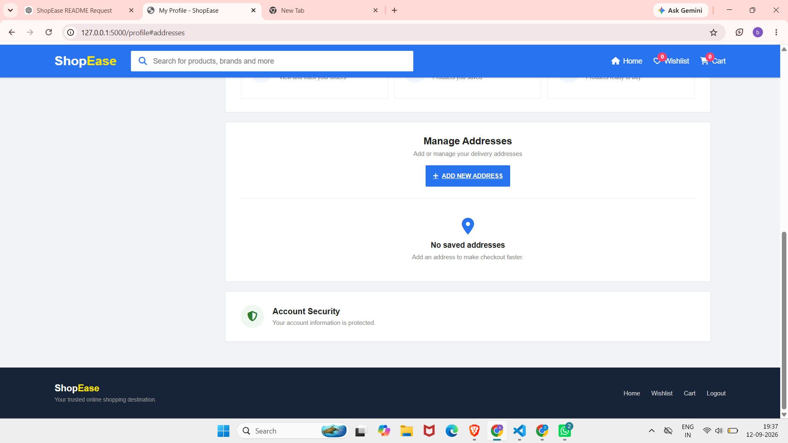

## 📍 deliver location Addresses

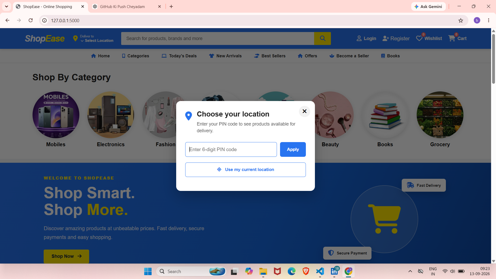

---

---

## 💳 Payment

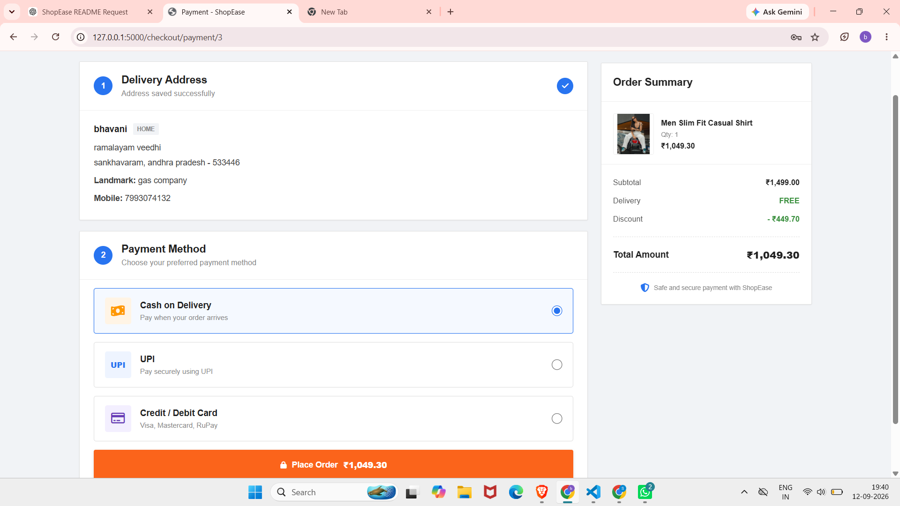

---

## ✅ Order Confirmation

---

## 📦 My Orders

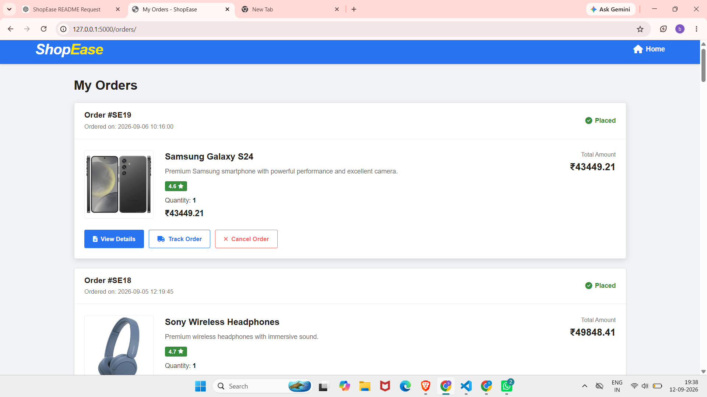

---

## 🚚 Track Order

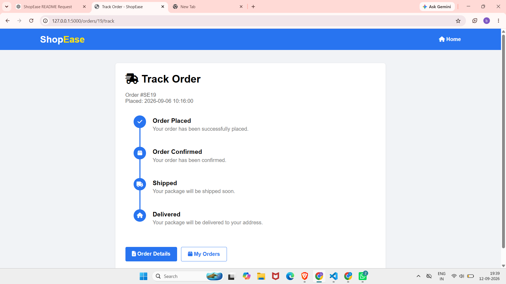

---

## 👤 User Profile

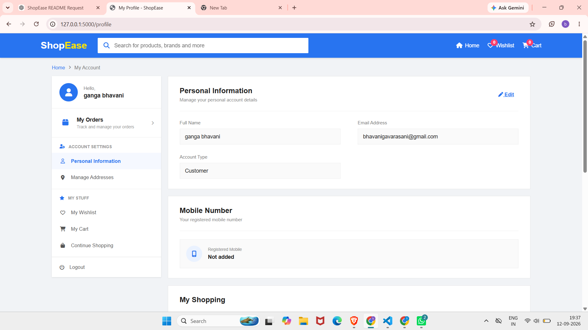

---

## ✏️ Edit Profile

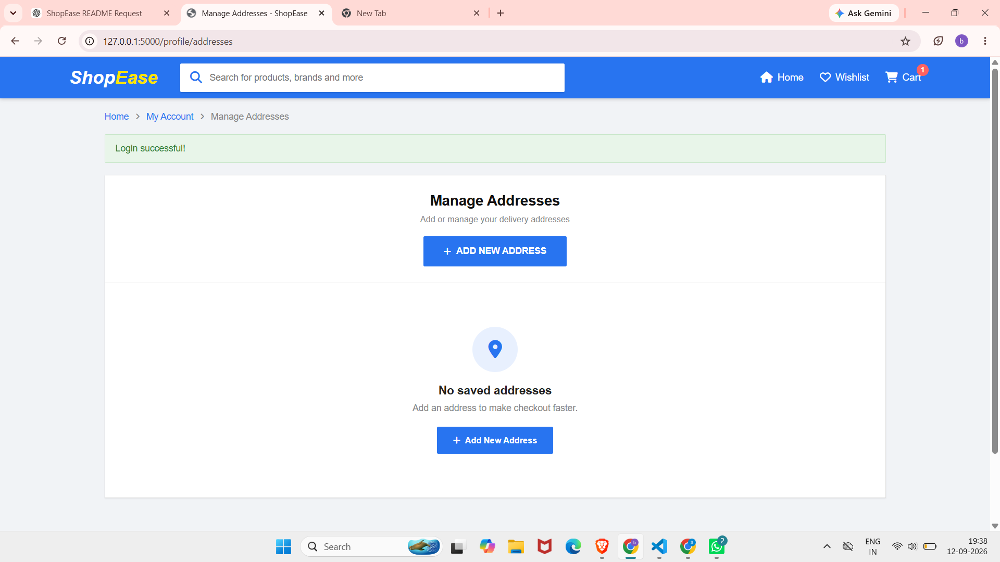

---

## ⭐ Product Reviews

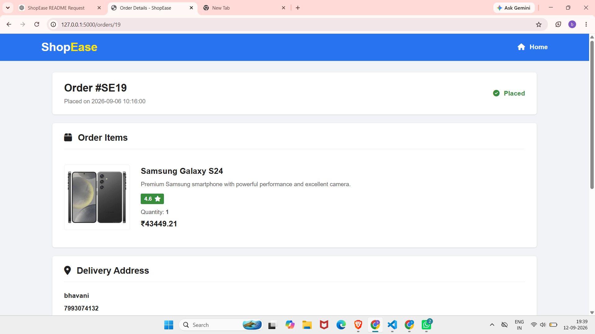

---

## ⚙️ Admin Dashboard

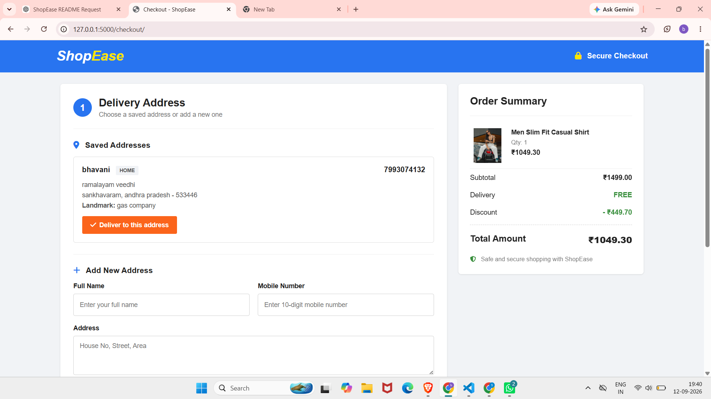

---

User Authentication

User registration and login

User logout

Password hashing

Forgot password functionality

Google OAuth login

Session-based authentication

User-specific cart and wishlist

Home Page

E-commerce navigation bar

Search bar

Product categories

Product cards

Featured products

Cart count

Wishlist count

User profile/account section

Products

View all products

Product details

Category filtering

Product search

Product sorting

Price and discount display

Ratings

Stock availability

Product images

Similar products

Add to cart

Add to wishlist

Categories

Mobiles

Electronics

Fashion

Footwear

Home

Beauty

Books

Grocery

Shopping Cart

Add products

Remove products

Increase/decrease quantity

View total quantity

View total price

User-specific cart

Cart synchronization with the database

Wishlist

Add products to wishlist

Remove products

View wishlist

Add wishlist products to cart

User-specific wishlist

Wishlist count

Checkout

Checkout from cart

Delivery address selection

Add and save address

Payment page

Order confirmation flow

Address Management

Users can: - Add addresses - Edit addresses - Manage saved addresses -
Use saved addresses during checkout

Address information includes: - Full name - Phone number - Address -
City - State - Pincode - Landmark

Orders

Users can: - View My Orders - View order details - View ordered
products - View product images - View quantity and price - View order
status - Track orders - Cancel eligible orders - Request returns for
delivered orders

Example order statuses:

Pending
Confirmed
Order Placed
Processing
Shipped
Out for Delivery
Delivered
Cancelled
Return Requested
Returned

Product Reviews

Product ratings

Review text

User reviews

Product review display

User Profile

View profile

Edit profile

Manage addresses

View orders

Access cart and wishlist

Logout

Admin

The application supports customer and admin roles.

Admin functionality can include: - Admin login - Product management -
Category management - User management - Inventory management - Order
management - Stock management

Project Structure

shopease/
│
├── __pycache__/
│
├── database/
│
├── routes/
│
├── static/
│
├── templates/
│
├── .env
├── app.py
├── config.py
├── database.py
├── product_images.zip
├── README.md
└── requirements.txt

Routes Structure

routes/
├── auth.py
├── home.py
├── products.py
├── cart.py
├── wishlist.py
├── checkout.py
├── orders.py
├── profile.py
├── reviews.py
├── search.py
├── admin.py
└── ai.py

Route Responsibilities

File            Responsibility

auth.py       Registration, login, logout and authentication
home.py       Home page
products.py   Product listing and product details
cart.py       Shopping cart
wishlist.py   Wishlist
checkout.py   Checkout, addresses and payment flow
orders.py     Orders, cancellation, returns and tracking
profile.py    User profile
reviews.py    Product reviews
search.py     Product search
admin.py      Admin functionality
ai.py         AI-related functionality

Static Files

static/
├── css/
├── js/
└── uploads/
    └── products/

The static folder contains CSS, JavaScript, product images, and other
frontend resources.

Templates

The templates folder contains the HTML pages used by the Flask
application.

templates/
├── home.html
├── login.html
├── register.html
├── products.html
├── cart.html
├── checkout/
├── orders/
├── profile/
└── admin/

Main Files

app.py

Main Flask application file. It initializes the application and
registers the required routes/blueprints.

config.py

Contains application and database configuration.

database.py

Handles the MySQL database connection.

.env

Stores sensitive configuration such as database credentials, secret
keys, OAuth credentials, and API keys.

requirements.txt

Contains the Python packages required to run the project.

product_images.zip

Contains product image resources used by the application.

Database

ShopEase uses MySQL.

Database Name

defaultdb

Main Tables

users
categories
products
cart
wishlist
addresses
orders
order_items
reviews

Users

Stores customer and administrator information.

Typical fields:

id
name
email
password
phone
role
created_at

Categories

Stores product categories.

Typical fields:

id
name
description
image
created_at

Products

Stores product information.

Typical fields:

id
category_id
name
description
price
discount
stock
image
rating
created_at

Cart

Stores products added to a user's cart.

id
user_id
product_id
quantity

Wishlist

Stores products saved by users.

id
user_id
product_id

Addresses

Stores delivery addresses.

id
user_id
full_name
phone
address
city
state
pincode
landmark

Technologies Used

Frontend

HTML5

CSS3

JavaScript

Font Awesome

Backend

Python

Flask

Database

MySQL

MySQL Connector

Authentication

Flask Sessions

Werkzeug password hashing

Google OAuth

Configuration

python-dotenv

UI Design

ShopEase uses a modern e-commerce interface inspired by popular shopping
platforms.

Theme

Primary Blue : #2874f0
Yellow       : #ffe500
Background   : #f1f3f6

The interface includes: - Navigation bar - Search bar - Category
navigation - Product cards - Cart - Wishlist - Checkout - Profile -
Orders - Responsive layouts

Installation

1. Clone the Repository

git clone <your-github-repository-url>
cd shopease

2. Create a Virtual Environment

Windows:

python -m venv venv
venv\Scripts\activate

Linux/macOS:

python3 -m venv venv
source venv/bin/activate

3. Install Dependencies

pip install -r requirements.txt

MySQL Setup

Create the database:

CREATE DATABASE ;

Select it:

USE defaultdb;

Then create or import all required ShopEase tables.

Environment Variables

Create a .env file in the project root.

Example:

DB_HOST=localhost
DB_USER=root
DB_PASSWORD=your_mysql_password
DB_NAME=shopease_db

SECRET_KEY=your_secret_key

GOOGLE_CLIENT_ID=your_google_client_id
GOOGLE_CLIENT_SECRET=your_google_client_secret

Do not upload the real .env file or credentials to GitHub.

Add the following to .gitignore:

.env
venv/
__pycache__/

Run the Application

Start the Flask application:

python app.py

Then open:

http://127.0.0.1:5000

in a web browser.

Application Workflow

Register / Login
       ↓
     Home
       ↓
Browse Products
       ↓
Search / Category
       ↓
Product Details
       ↓
Cart / Wishlist
       ↓
Checkout
       ↓
Delivery Address
       ↓
Payment
       ↓
Order Confirmation
       ↓
My Orders
       ↓
Track / Cancel / Return

Security

The application uses: - Password hashing - Session-based
authentication - User-specific records - Role-based access - Input
validation - Environment variables for sensitive configuration

Project Objectives

Develop a complete e-commerce web application.

Implement secure user authentication.

Connect the application with MySQL.

Implement database-driven product management.

Implement cart and wishlist functionality.

Implement checkout and address management.

Implement payment workflow.

Implement order management and tracking.

Implement cancellation and return functionality.

Implement product reviews and ratings.

Provide profile management.

Provide admin functionality.

Create a modern and responsive shopping interface.

Learning Outcomes

This project demonstrates practical knowledge of: - Python - Flask -
Flask Blueprints - MySQL - SQL - CRUD operations - Database
relationships - Authentication - Password hashing - Session management -
Google OAuth - HTML - CSS - JavaScript - Responsive web design -
E-commerce workflows - File and image handling - Frontend and backend
integration

Future Enhancements

Possible future improvements: - Razorpay payment gateway - Stripe
payment integration - Real-time order tracking - Email notifications -
SMS notifications - Coupon system - Product comparison - Advanced
product recommendations - AI shopping assistant - Sales analytics -
Advanced admin dashboard - Inventory alerts - Delivery partner
integration - Mobile application

Project

ShopEase

A full-stack online shopping web application built using:

Python + Flask + MySQL + HTML + CSS + JavaScript

License

This project is developed for educational and project demonstration
purposes.

ShopEase

Browse. Shop. Track. Enjoy.